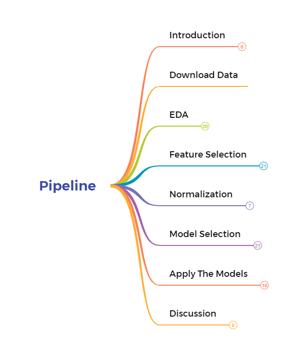

# README

## Pipeline description

Machine learning is a powerful tool to achieve prediction. This pipeline is shown below, the completed picture is [here](https://github.com/uqer-jyh/Machine-learning-pipeline/blob/main/Pipeline.pdf)

## Report Abstract

Machine learning solve the question of how to build computers that improve automatically through experience. It is one of today’s most rapidly growing technical fields which standing at the intersection of computer science and statistics. In this report, we will implement classification, clustering, regression, and dimensionality reduction tasks using a variety of machine learning methods. By comparing the performance of different models, we can get the most suitable model for the corresponding task. In the classification task, the random forest model is the most suitable model. the F1 score is 91.63. In the regression task, the model combining XGBoost and LightGBM is the most suitable model. the RMSE score is 56.61.

## Dataset description

The dataset is from Kaggle website. Which is a famous data science forum. The link of dataset is below:

 https://www.kaggle.com/datasets/alanjo/cpu-benchmarks
